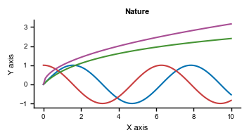

# Nature Style Plotting Template for Matplotlib

This repository provides a Python script to apply Nature journal's style to `matplotlib` plots. It includes customized plot settings and color palettes insprired by Nature publications.

Source:
- [Nature Artwork Guide](https://www.nature.com/documents/natrev-artworkguide.pdf)
- 

## Features

- **Nature Style Configurations**: Configure matplotlib plots with settings that align with Nature's style guide.
- **Color Palettes**: Multiple color palettes proposed by Nature. The colors were identified using Pick colors function of Inkscape.


## Installation

1. Clone this repository or download the Python script directly.
2. Ensure you have `matplotlib` installed in your Python environment. If not, you can install it using:

   ```bash
   pip install matplotlib
   ```

## Usage

1. Place `nature_plot_style.py` file in your folder
2. import the `set_nature_style` function from the script and apply it before plotting:

```python
import nature_plot_style as nps  

# Apply Nature Journal style settings
nps.set_nature_style()

# Visualize the Nature-branded color palettes
nps.plot_color_palettes()

# Set width to inches for figure size
figwidth= 90 # 90mm or 180mm
ratio = 16/9
width_in_inches = figwidth / 25.4
height_in_inches = width_in_inches /ratio  # Maintain a aspect ratio
# To be used when create a plot: figsize=(width_in_inches, height_in_inches)

# Your plotting code here
```

## Examples

Currently, only `test.py` is provided.

